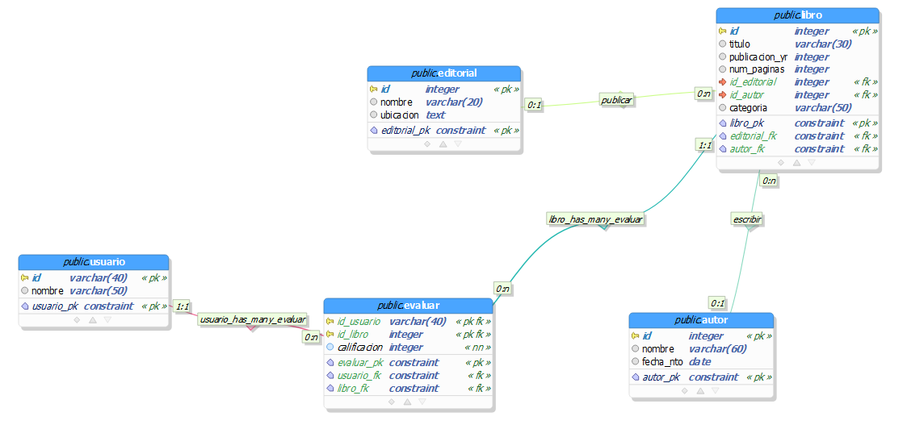

<h1 align="center"> Amazon Books Reviews</h1>

 Juan Esteban Gonzalez, Valentina López y Sara Rodríguez 

## Tabla de contenidos:

- [Reglas de negocio](#reglas-de-negocio)
- [Tabla Entidad Relacion](#tabla-er)
- [Diagrama Entidad Relacion](#diagrama-entidad-relacion)
- [Diagrama Relacional](#diagrama-relacional)
- [Diagrama Relacional normalizado](#diagrama-relacional-normalizado)
- [Base de datos](#Base-de-datos)
- [Carga Masiva](#Carga-Masiva)

### Reglas de negocio 

1. Todos los libros tienen una editorial, titulo, año de publicación, número de páginas y autor. 

2. Los libros cuentan con un Id único, un precio y se clasifican por categoría. 

3. Cada editorial se identifica con in Id únicos, un nombre y cuenta con el número de libros. 

4. Cada autor tiene un Id único, fecha de nacimiento, nombre y número de libros. 

5. Cada autor debe tener al menos un libro. 

6. Cada usuario tiene un Id único y un nombre 

7. El puntaje de un autor está determinado por el promedio ponderado del puntaje de sus libros. 

8. Los usuarios pueden puntuar libros que han leído. 

9. Poder contar el número de libros asociados a un autor. 

10. Poder contar el número de libros asociados a una editorial. 

11. Generar un ranking de los mejores libros por segmento de edad. 

12. Generar un ranking de los mejores libros por número de páginas. 

13. Generar un ranking de los mejores libros por editorial. 

14. Generar un ranking de los libros por autor. 

### Tabla Entidad Relacion

 

### Diagrama Entidad Relación

 

### Diagrama Relacional

 

### Diagrama Relacional Normalizado
Cabe resaltar que en este diagrama, algunos varchar han aumentado su tamaño, pues al realizar la carga masiva nos dimos cuenta que la cantidad de caracteres que habíamos asignado para algunos datos era insuficiente

 

## Base de datos
En la carpeta Entrega 2 se encuentra el archivo de DDL Scripts_tablas.sql donde se encuentran las sentencias sql para la creacion de las tablas: Autor, categoria,editorial,evaluar,libro,ubicación.

## Carga Masiva
En la carpeta Entrega 2 se encuentra el archivo de DDL Carga_masiva_de_datos.sql donde se encuentran las sentencias sql para la la carga de datos desde los diferentes archivos csv  con los datos de la tablas de la sigunete forma
~~~
---Carga masiva de la tabla categoria
COPY categoria FROM 'C:tablas_f\categoria_f.csv' WITH DELIMITER ';' CSV HEADER; --check

~~~

## Analisis de Escenarios con Dash

Editorial y el autor que publica los libros con las mejores calificaciones. 
Por medio de los diagramas de pie y de líneas, este análisis permite ver cuantas obras son consideradas literatura de alta calidad, por lo que facilitará a los usuarios de la plataforma de Amazon, filtrar la búsqueda de libros de forma más satisfactoria dependiendo a las características que deseen, por otro lado, Amazon podrá saber la calidad literaria que posee, pues si tiene una gran cantidad de reseñas desfavorables, sería pertinente ampliar o modificar el catálogo de libros. 

 

 

 

 

Como se ve en las gráficas, en Calificación autores, más del 86% de los autores tienen una calificación de entre 4 y 5 puntos. Pasa de forma similar en Calificación editoriales, pues más del 89% de las editoriales tienen una calificación entre 4 y 5 puntos, es decir, la calidad literaria percibida por los lectores de Amazon es bastante alta. Esto también puede indicar que las personas que tienen buenas opiniones acerca de un libro son más propensas a dejar una reseña en la página.  

Una desventaja de estos diagramas de pie es que, si bien nos permiten ver los porcentajes de las calificaciones obtenidas, no nos permiten ver cuáles fueron las editoriales que obtuvieron estas calificaciones. 

Editorial y el autor que cuentan con mayor cantidad de libros.

Gracias a este análisis por medio de este diagrama de barras se puede tener un control entre la calidad y cantidad de libros, así evaluar realmente cuales autores y editoriales logran cumplir una total satisfacción para los usuarios. Se conseguirá comparando los datos obtenidos de ambas consultas, para poder observar la relación.

 

 

Aquí podemos ver que Rose Amy es la autora con más cantidad de libros en Amazon (cabe aclarar, no significa que tenga más libros publicados, pues dos ediciones de un mismo libro son catalogadas como libros distintos por el sistema de Amazon). Seguida de ella está el famoso autor William Shakespeare, y en tercer lugar se encuentra la biblioteca del congreso de Estados Unidos, lo que nos da un conjunto de variopintos autores, demostrando así que la gente hoy en día está muy interesada tanto en la política como en clásicos. 

En el diagrama de Libros Editorial se puede visualizar como Simon and Schuster, es la editorial con más cantidad de libros, en segundo lugar, Penguln y en tercer lugar Routledge. Como fue mencionado anteriormente, tener estos datos de manera grafica facilita tener un mejor control con cada editorial, colocando pautas o verificando que esa cantidad de libros es acorde a los parámetros que tenga Amazon.  

Las gráficas son muy explicativas, y nos dejan observar de forma clara cuales son los autores y editoriales con más libros publicados, pero una desventaja con la que cuenta es que, debido al volumen de datos, no es posible mostrarlos todos al mismo tiempo, por lo que se deben de recortar y mostrar los primeros 20 para ser capaces de visualizarla. 

Año en el cual los mejores libros fueron publicados 

Se obtuvo un promedio de los libros con las mejores calificaciones por año, esto ayuda a analizar si el contexto cultural del momento ha influenciado, y qué es lo que ha hecho de ese año uno tan productivo para las obras literarias. Por otro lado, destacar a los mejores libros de cada año que podría servir para realizar otro análisis de escoger al mejor libro de cada década.  

Algo a destacar de la siguiente gráfica es que antes de 1800 la cantidad de libros publicados es mínima, y al momento de graficar termina dispersando de forma desproporcional los datos, por lo cual, para poder visualizar de mejor forma los datos, esta parte fue removida 

 

Como se puede observar en la gráfica de líneas, a mediados de la década del 2000 es cuando más libros se han publicado en la plataforma, siendo esta época cuando el internet se volvió masivo, y la digitalización se convirtió en algo esencial (Abbate, J). Así mismo, han sido estos últimos años cuando es común ver libros publicados solo digitalmente. Aunque también es interesante analizar que, mientras más se acerca la gráfica a nuestra actualidad, la cantidad de libros se ve reducida. 

La gráfica nos muestra una clara alza y caída en la cantidad de libros publicados por años, pero por la cantidad de datos no se puede ver detalladamente año por año. Aunque, si se disminuyeran la cantidad de datos, no sería posible analizar de buena forma cómo se dispersan estos y las subidas y bajadas que estos presentan. 

Clasificar libros por categoría 

El objetivo de esta clasificación por medio de diagrama de barras es satisfacer al usuario para darle información más detallada sobre un determinado tema de interés entre miles de opciones. Amazon podrá ver cuáles son las categorías en donde más tienen libros, ver cuáles son sus carencias y así enriquecer a estas si lo ve necesario. 

En el diagrama se puede observar que la ficción es el género donde se encuentran mayor cantidad de libros, seguidos por religión e historia. Esto nos indica que, además de ser la categoría más leída, la ficción, al permitirnos abstraernos de nuestra realidad, nos atrae de sobremanera. Además, la religión es el segundo género más frecuente, esto se evidencia por el hecho de que la biblia es uno de los libros más vendidos en todo el mundo (El Universal, 2018).  

Este tipo de diagrama presenta la ventaja y desventaja antes propuesta; muy claro, pero pocos datos visibles. 

##Conclusiones

Fuentes de datos 

Existen diversas plataformas en donde se pueden obtener bases datos con numerosos temas, y en cada una de ellas nos dimos cuenta de que se pueden presentar este tipo de proyectos en distintos campos laborales. 

 

Escogimos una enriquecedora y desafiante base de datos, ya que, al tener algunas tablas con más de cien mil datos, el proceso de corregir problemas de caracteres para la correcta carga de datos fue un poco ardua, pero gracias a unas especificas herramientas pudimos lograr el objetivo y además obtuvimos nuevos conocimientos. 

 

Bases de datos 

La carga masiva de datos tiene una gran utilidad ya que simplifica el ingreso de los datos, facilita dividir los datos en las tablas requeridas por medio de documentos CSV, además permite un acceso rápido a toda la información que se debe registrar, aunque al momento de realizar la carga es importante asegurarse que cada dato de la base de datos se encuentre sin errores de caracteres. 

 

Normalizar la base de datos fue un proceso muy efectivo. Esto se debe a que desde el inicio existían pocas tablas y las relaciones establecidas evitaban transitividad entre tablas. La normalización permitió realizar las consultas de manera más eficaz y mantener un orden en la base de datos. Además, permitió que, a la hora de realizar los análisis, facilitara la realización de las consultas. 

 

Análisis con DASH 

Dash nos permite ver de forma clara y sencilla la recopilación de los datos, pues de forma gráfica se suelen entender mejor las cosas, incluyendo los datos. Además, al permitirnos graficar nuestras consultas, no es necesario hacer un detallado escrutinio de los miles de tuplas resultantes de las consultas, y podemos entender y analizar los datos. 

 

Así mismo, encontramos dificultades al usar dash, en específico al importar las librerías, pues algunas de nuestras máquinas estaban desactualizadas o tenían ciertas restricciones para el usuario con el cuál accedíamos que no nos permitía acceder, o bien a la base de datos, o a la consola, para poder ejecutar allí los archivos de Python. 

 

##Bibliografia 

¿Cuáles son los libros más vendidos en la historia? (2018, 23 abril). El Universal. https://www.eluniversal.com.mx/cultura/letras/cuales-son-los-libros-mas-vendidos-en-la-historia 

 

Abbate, J. (s. f.). Internet: su evolución y sus desafíos. OpenMind. https://www.bbvaopenmind.com/articulos/internet-su-evolucion-y-sus-desafios/ 

 

 

