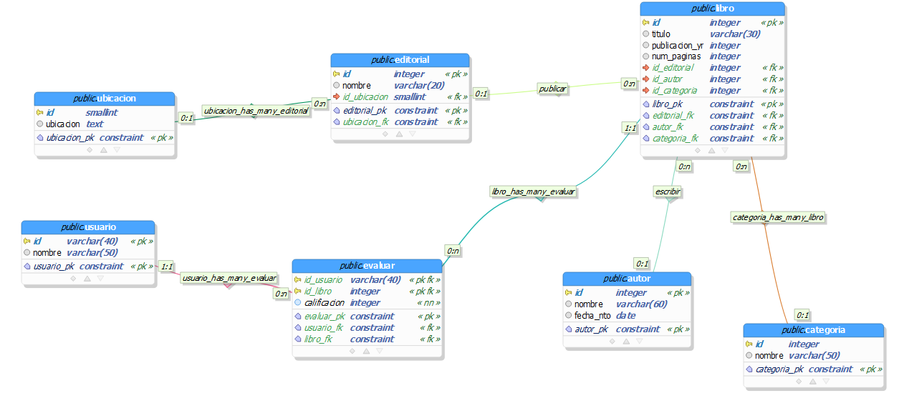

<h1 align="center"> Amazon Books Reviews</h1>

 Juan Esteban Gonzalez, Valentina López y Sara Rodríguez 

## Tabla de contenidos:
---

* [Reglas de negocio](#reglas-de-negocio)
* [Tabla Entidad Relación](#tabla-er)
* [Diagrama Entidad Relación](#diagrama-entidad-relacion)
* [Diagrama Relacional](#diagrama-relacional)
* [Diagrama Relacional normalizado](#diagrama-relacional-normalizado)

### Reglas de negocio 

1. Todos los libros tienen una editorial, titulo, año de publicación, número de páginas y autor. 

2. Los libros cuentan con un Id único, un precio y se clasifican por categoría. 

3. Cada editorial se identifica con in Id únicos, un nombre y cuenta con el número de libros. 

4. Cada autor tiene un Id único, fecha de nacimiento, nombre y número de libros. 

5. Cada autor debe tener al menos un libro. 

6. Cada usuario tiene un Id único y un nombre 

7. El puntaje de un autor está determinado por el promedio ponderado del puntaje de sus libros. 

8. Los usuarios pueden puntuar libros que han leído. 

9. Poder contar el número de libros asociados a un autor. 

10. Poder contar el número de libros asociados a una editorial. 

11. Generar un ranking de los mejores libros por segmento de edad. 

12. Generar un ranking de los mejores libros por número de páginas. 

13. Generar un ranking de los mejores libros por editorial. 

14. Generar un ranking de los libros por autor. 

### Tabla Entidad Relación

 

### Diagrama Entidad Relación

 

### Diagrama Relacional

 

### Diagrama Relacional Normalizado
Cabe resaltar que en este diagrama, algunos varchar han aumentado su tamaño, pues al realizar la carga masiva nos dimos cuenta que la cantidad de caracteres que habíamos asignado para algunos datos era insuficiente

 
